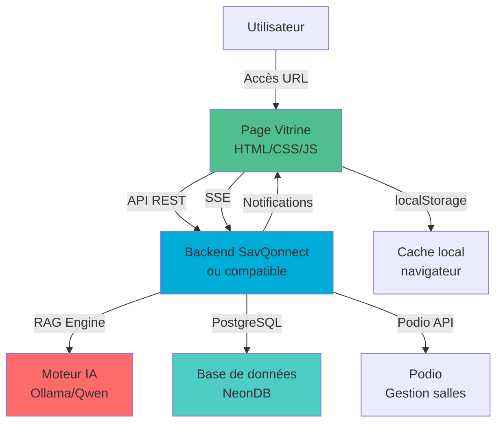
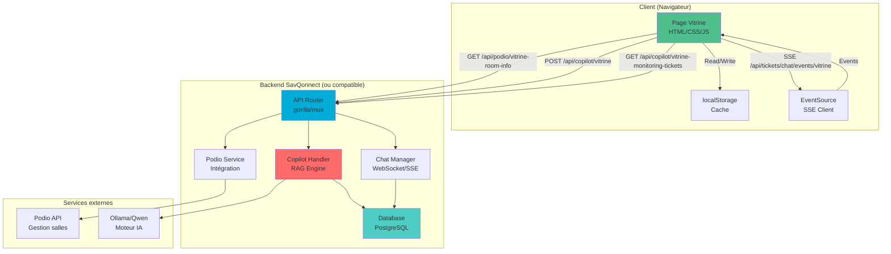

# Handover technique — Projet Vitrine (page web de diagnostic / monitoring)

**Version**: 1.0  
**Date**: 2025-01-XX  
**Auteur**: Analyse technique SAVQonnect  
**Statut**: Documentation complète

---

## A. Résumé exécutif

**Vitrine** est une page web standalone (HTML/CSS/JavaScript) conçue pour permettre aux usagers (professeurs, étudiants, personnel) de signaler des problèmes techniques dans les salles de classe de l'UQAM. La page fonctionne comme une interface publique de diagnostic et de monitoring, sans nécessiter d'authentification.

**⚠️ IMPORTANT — Double usage** :
Vitrine sert **à la fois les usagers ET les techniciens** :
- **Mode usager** : Interface publique pour signaler des problèmes (vue par défaut)
- **Mode technicien** : Page cachée accessible via un raccourci/clé secrète, affichant des ressources techniques avancées (plans PDF de salle, documentation équipements, outils de diagnostic)

**Utilisateurs cibles** :
- **Usagers** : Professeurs et étudiants utilisant les salles équipées, personnel administratif
- **Techniciens** : Accès à une page cachée avec ressources techniques (plans PDF, documentation, outils avancés)

**Problème résolu** :
Vitrine permet de signaler rapidement des problèmes audiovisuels (projecteur, son, écran tactile, etc.) directement depuis la salle, sans avoir à contacter le support par téléphone ou email. Le système analyse automatiquement le problème via un moteur IA (RAG) et peut proposer des solutions automatiques ou créer des tickets d'intervention.

**⚠️ IMPORTANT — Compatibilité backend** :
Vitrine est conçue pour fonctionner avec **n'importe quel backend similaire à SavQonnect**. Elle communique exclusivement via des endpoints API REST publics (sans authentification), ce qui permet une intégration flexible avec différents systèmes de monitoring audiovisuel. La page est **agnostique du backend** tant que celui-ci expose les endpoints documentés ci-dessous.

**📌 Note importante** :
La fonctionnalité **"Appel"** (appel téléphonique direct au support) a été **supprimée** de Vitrine. Les utilisateurs doivent désormais utiliser le système de tickets et de chat intégré pour contacter le support technique.

---

## B. Portée fonctionnelle

### Fonctionnalités visibles (UI)

1. **Interface de signalement de problème**
   - Champ de texte libre pour décrire le problème
   - Suggestions contextuelles basées sur l'intent détecté
   - Affichage de la salle courante (détection automatique ou sélection manuelle)

2. **Affichage de l'état de la salle**
   - Statut des équipements principaux (projecteur, audio, écran)
   - Badges de statut colorés (vert/orange/rouge)
   - Informations de la salle (pavillon, bassin, capacité, type)

3. **Widget Monitoring (sidebar)**
   - Liste des tickets SEA en cours
   - Statut d'assignation des tickets
   - Filtres par statut, priorité, salle
   - Mise à jour en temps réel via SSE (Server-Sent Events)

4. **Système de chat intégré**
   - Communication bidirectionnelle avec le support technique (Tickets SEA)
   - Notifications en temps réel
   - Historique des conversations
   - Mode rappel (client demande un rappel)

5. **Actions automatiques**
   - Redémarrage silencieux d'équipements (si confidence IA >= 0.9)
   - Contrôle AV Mute (activation/désactivation)
   - Vérification de statut PJLink
   - Affichage des résultats d'actions automatiques

6. **Gestion des tickets**
   - Création automatique de tickets SEA depuis un signalement
   - Consultation de l'historique des tickets pour la salle
   - Mise à jour de statut (résolu, en cours, fermé)
   - Suppression automatique des tickets fermés

7. **Page cachée technicien (mode avancé)**
   - Accès via raccourci clavier ou URL spéciale (ex: `?mode=tech` ou `?key=technician`)
   - Affichage du plan PDF de la salle (intégré via iframe ou viewer PDF)
   - Ressources techniques supplémentaires :
     - Documentation des équipements (fiches techniques, schémas de câblage)
     - Historique des interventions sur la salle
     - Liste détaillée des équipements avec adresses IP, modèles, firmware
     - Outils de diagnostic avancés (ping, test de connectivité)
     - Liens vers interfaces d'administration des équipements (si accessibles)
   - Interface optimisée pour les techniciens en intervention

### Fonctionnalités en arrière-plan (automation)

1. **Polling périodique**
   - Récupération des tickets toutes les X secondes (configurable)
   - Vérification de l'état des équipements
   - Mise à jour du widget Monitoring

2. **SSE (Server-Sent Events)**
   - Connexion persistante pour les notifications temps réel
   - Événements de changement de statut de ticket
   - Événements de chat (nouveau message, typing indicators)

3. **Détection automatique de salle**
   - Tentative de détection via URL, paramètres, ou localStorage
   - Fallback sur sélection manuelle si échec

4. **Cache local**
   - Stockage des informations de salle dans localStorage
   - Cache des réponses API pour réduire les appels réseau

5. **Gestion d'erreurs et retry**
   - Retry automatique sur échec réseau (avec backoff exponentiel)
   - Affichage de messages d'erreur utilisateur-friendly
   - Fallback gracieux si backend indisponible

---

## C. Parcours utilisateur (scénarios)

### Scénario 1 : Un usager ouvre la page et lit l'état d'une salle

**Étapes** :
1. L'usager accède à l'URL de Vitrine (ex: `https://savqonnect.uqam.ca/vitrine?room=A-1750`)
2. La page charge et détecte automatiquement la salle depuis le paramètre URL `room`
3. Un appel API `GET /api/podio/vitrine-room-info?room=A-1750` récupère les informations de la salle
4. Un appel API `GET /api/copilot/vitrine-monitoring-devices?room_id=A-1750` récupère l'état des équipements
5. L'interface affiche :
   - Nom de la salle, pavillon, type, capacité
   - Statut des équipements avec badges colorés
   - Widget Monitoring avec tickets en cours (si sidebar ouverte)

**Fichiers concernés** :
- `index.html` (ou `vitrine.html`) : Structure HTML
- `script.js` : Fonctions `detectRoom()`, `loadRoomInfo()`, `loadDevices()`
- `style.css` : Styles des badges et cards

**Endpoints utilisés** :
- `GET /api/podio/vitrine-room-info?room={roomName}` (misc_handlers.go:7436)
- `GET /api/copilot/vitrine-monitoring-devices?room_id={roomId}` (misc_handlers.go:225)

---

### Scénario 2 : Un usager décrit un problème et la page affiche des détails

**Étapes** :
1. L'usager saisit dans le champ texte : "Pas de son en salle A-1750"
2. Clic sur "Signaler" ou appui sur Entrée
3. Appel API `POST /api/copilot/vitrine` avec payload :
   ```json
   {
     "message": "Pas de son en salle A-1750",
     "context": {
       "room": "A-1750",
       "source": "vitrine",
       "timestamp": "2025-01-XX..."
     }
   }
   ```
4. Le backend traite via le moteur RAG (Recherche Augmentée par Génération)
5. Réponse API contient :
   - `intent` : Intent détecté (ex: "audio_issue")
   - `confidence` : Niveau de confiance (0.0 à 1.0)
   - `problems` : Liste des problèmes identifiés
   - `solutions` : Solutions proposées
   - `actions` : Actions automatiques possibles
   - `auto_executed` : Booléen indiquant si des actions ont été exécutées automatiquement
6. L'interface affiche :
   - Message d'explication du problème
   - Solutions suggérées
   - Boutons d'actions (si confidence < 0.9, sinon actions déjà exécutées)
   - Résultat des actions automatiques (si `auto_executed === true`)

**Fichiers concernés** :
- `script.js` : Fonction `submitProblem()`, `handleCopilotResponse()`
- `index.html` : Zone d'affichage des résultats (`#copilot-response`)

**Endpoints utilisés** :
- `POST /api/copilot/vitrine` (main.go:6774)

**Code référence** :
```6773:6914:main.go
// copilotVitrineHandler - Endpoint spécifique pour la vitrine sans authentification
func copilotVitrineHandler(w http.ResponseWriter, r *http.Request) {
	// ... validation et traitement RAG ...
}
```

---

### Scénario 3 : Un technicien consulte des statuts détaillés via la sidebar

**Étapes** :
1. Le technicien ouvre la sidebar (bouton ou raccourci clavier)
2. La sidebar affiche le widget Monitoring
3. Appel API `GET /api/copilot/vitrine-monitoring-tickets` (sans paramètres = tous les tickets)
4. La réponse contient la liste des tickets avec :
   - `ticket_number`, `status`, `priority`, `title`
   - `room`, `device_name`
   - `assigned_to_username`, `is_assigned`
   - `created_at`, `updated_at`
5. L'interface affiche :
   - Liste des tickets triés (non assignés en premier)
   - Badges de statut (nouveau, en cours, résolu, fermé)
   - Badges de priorité (critique, haute, normale, basse)
   - Indicateur d'assignation
6. Filtres disponibles :
   - Par statut : `?status=open`
   - Par priorité : `?priority=high`
   - Par salle : `?room=A-1750`

**Fichiers concernés** :
- `script.js` : Fonction `loadMonitoringTickets()`, `renderTicketsList()`
- `style.css` : Styles de la sidebar et des cards de tickets

**Endpoints utilisés** :
- `GET /api/copilot/vitrine-monitoring-tickets` (misc_handlers.go:139)
- `GET /api/copilot/vitrine-monitoring-tickets?status=open&room=A-1750` (avec filtres)

**Code référence** :
```139:222:misc_handlers.go
// vitrineMonitoringTicketsHandler - Endpoint PUBLIC (sans auth) pour le widget Monitoring
func vitrineMonitoringTicketsHandler(w http.ResponseWriter, r *http.Request) {
	// ... récupération tickets avec colonnes d'assignation ...
}
```

---

### Scénario 4 : Un bouton déclenche une action (ex: redémarrage silencieux / reboot)

**Étapes** :
1. L'usager signale un problème et le système propose une action : "Redémarrer le projecteur"
2. Si `confidence >= 0.9`, l'action est exécutée automatiquement (voir Scénario 2)
3. Si `confidence < 0.9`, un bouton "Exécuter" apparaît dans l'interface
4. Clic sur le bouton → Appel API `POST /api/copilot/execute-smart-action` avec payload :
   ```json
   {
     "action_type": "reboot_device",
     "device_id": "123",
     "device_name": "Projecteur A-1750",
     "room": "A-1750"
   }
   ```
5. Le backend exécute l'action (ex: commande PJLink `POWR 0` puis `POWR 1`)
6. Réponse API contient :
   - `success` : Booléen
   - `message` : Message de résultat
   - `result` : Détails techniques (optionnel)
7. L'interface affiche le résultat avec un badge de succès/échec

**Fichiers concernés** :
- `script.js` : Fonction `executeAction()`, `handleActionResult()`
- `index.html` : Boutons d'actions dynamiques

**Endpoints utilisés** :
- `POST /api/copilot/execute-smart-action` (main.go:4058) — **Note** : Cet endpoint nécessite une authentification dans SavQonnect, mais Vitrine peut utiliser des endpoints publics équivalents dans d'autres backends

**⚠️ Compatibilité backend** :
Pour qu'un backend soit compatible avec Vitrine, il doit exposer un endpoint équivalent qui accepte les actions et les exécute. L'endpoint peut être public (comme les autres endpoints Vitrine) ou utiliser un système d'authentification léger (token API, clé publique).

---

### Scénario 5 : Cas d'erreur — équipement offline / timeout / API indisponible

**Étapes** :
1. L'usager tente de signaler un problème
2. Appel API `POST /api/copilot/vitrine` échoue (timeout, 500, 503)
3. Le système JavaScript détecte l'erreur et active le retry automatique :
   - Tentative 1 : Immédiate
   - Tentative 2 : Après 1 seconde
   - Tentative 3 : Après 2 secondes
   - Tentative 4 : Après 4 secondes
4. Si toutes les tentatives échouent :
   - Affichage d'un message d'erreur utilisateur-friendly
   - Proposition de créer un ticket manuellement
   - Option de réessayer plus tard
5. Si l'équipement est offline (détecté par le backend) :
   - Réponse API contient `"status": "error"` avec `"message": "Équipement hors ligne"`
   - L'interface affiche un badge rouge "Hors ligne"
   - Proposition de créer un ticket d'intervention

**Fichiers concernés** :
- `script.js` : Fonction `fetchWithRetry()`, `handleError()`, `showErrorMessage()`
- `style.css` : Styles des messages d'erreur

**Gestion d'erreurs** :
- Timeout réseau : 10 secondes par défaut
- Retry avec backoff exponentiel (max 3-4 tentatives)
- Fallback gracieux : Mode dégradé avec fonctionnalités limitées

---

### Scénario 6 : Un technicien accède à la page cachée avec ressources techniques

**Étapes** :
1. Le technicien accède à Vitrine avec le mode technicien activé :
   - **Méthode 1** : Raccourci clavier (ex: `Ctrl+Shift+T` ou `Alt+T`)
   - **Méthode 2** : URL avec paramètre (ex: `?mode=tech` ou `?key=technician`)
   - **Méthode 3** : Clic long ou double-clic sur un élément spécifique (ex: logo ou titre)
2. La page détecte le mode technicien et charge la vue avancée :
   - Masquage des éléments simplifiés (interface usager)
   - Affichage de la section technicien (`#technician-panel`)
3. Chargement des ressources techniques :
   - Appel API `GET /api/podio/vitrine-room-info?room=A-1750&mode=tech` pour récupérer :
     - URL du plan PDF de la salle
     - Documentation des équipements
     - Historique des interventions
   - Appel API `GET /api/copilot/vitrine-technician-resources?room=A-1750` pour :
     - Liste détaillée des équipements (IP, modèles, firmware, statut)
     - Schémas de câblage (si disponibles)
     - Liens vers interfaces d'administration
4. Affichage des ressources :
   - **Plan PDF** : Intégré via `<iframe>` ou viewer PDF (ex: PDF.js) dans `#room-plan-viewer`
   - **Documentation équipements** : Liste déroulante ou onglets avec fiches techniques
   - **Historique interventions** : Tableau avec dates, techniciens, actions effectuées
   - **Outils de diagnostic** : Boutons pour ping, test connectivité, logs équipements
5. Le technicien peut :
   - Consulter le plan PDF pour localiser les équipements dans la salle
   - Accéder à la documentation technique d'un équipement spécifique
   - Voir l'historique des interventions précédentes
   - Utiliser les outils de diagnostic pour tester la connectivité
   - Accéder aux interfaces d'administration des équipements (si réseau local)

**Fichiers concernés** :
- `script.js` : Fonctions `enableTechnicianMode()`, `loadTechnicianResources()`, `renderRoomPlan()`, `renderEquipmentDocs()`
- `index.html` : Section `#technician-panel` (cachée par défaut avec `display: none`)
- `style.css` : Styles pour le mode technicien (`.technician-mode`, `.room-plan-viewer`, `.equipment-docs`)

**Endpoints utilisés** :
- `GET /api/podio/vitrine-room-info?room={room}&mode=tech` (extension avec mode technicien)
- `GET /api/copilot/vitrine-technician-resources?room={room}` (nouvel endpoint pour ressources technicien)
- `GET /api/copilot/vitrine-equipment-details?room={room}` (détails techniques équipements)
- `GET /api/copilot/vitrine-intervention-history?room={room}` (historique interventions)

**Sécurité** :
- Le mode technicien peut être protégé par :
  - Clé secrète dans l'URL (`?key=technician-secret-key`)
  - Vérification côté backend (si authentification légère requise)
  - Session localStorage avec expiration (optionnel)

**Exemple de structure HTML** :
```html
<!-- Section cachée par défaut -->
<div id="technician-panel" style="display: none;">
  <div class="technician-header">
    <h2>🔧 Mode Technicien - Salle A-1750</h2>
    <button onclick="exitTechnicianMode()">Retour mode usager</button>
  </div>
  
  <div class="technician-content">
    <!-- Plan PDF de la salle -->
    <section id="room-plan-section">
      <h3>📐 Plan de la salle</h3>
      <div id="room-plan-viewer">
        <iframe src="/api/room-plans/A-1750.pdf" width="100%" height="600px"></iframe>
      </div>
    </section>
    
    <!-- Documentation équipements -->
    <section id="equipment-docs-section">
      <h3>📚 Documentation équipements</h3>
      <div id="equipment-docs-list"></div>
    </section>
    
    <!-- Historique interventions -->
    <section id="intervention-history-section">
      <h3>📋 Historique des interventions</h3>
      <div id="intervention-history-list"></div>
    </section>
    
    <!-- Outils de diagnostic -->
    <section id="diagnostic-tools-section">
      <h3>🛠️ Outils de diagnostic</h3>
      <div id="diagnostic-tools"></div>
    </section>
  </div>
</div>
```

**Code JavaScript (exemple)** :
```javascript
// Détection du mode technicien
function enableTechnicianMode() {
  const urlParams = new URLSearchParams(window.location.search);
  const mode = urlParams.get('mode');
  const key = urlParams.get('key');
  
  // Vérifier si le mode technicien est activé
  if (mode === 'tech' || key === 'technician' || localStorage.getItem('vitrine_tech_mode') === 'true') {
    document.getElementById('technician-panel').style.display = 'block';
    document.getElementById('vitrine-container').style.display = 'none'; // Masquer interface usager
    
    // Charger les ressources
    loadTechnicianResources();
  }
}

// Charger les ressources techniques
async function loadTechnicianResources() {
  const room = detectRoom();
  
  // Charger le plan PDF
  const planUrl = await fetch(`/api/podio/vitrine-room-info?room=${room}&mode=tech`)
    .then(r => r.json())
    .then(data => data.room_plan_pdf_url);
  
  document.getElementById('room-plan-viewer').innerHTML = 
    `<iframe src="${planUrl}" width="100%" height="600px"></iframe>`;
  
  // Charger les ressources techniques
  const resources = await fetch(`/api/copilot/vitrine-technician-resources?room=${room}`)
    .then(r => r.json());
  
  renderEquipmentDocs(resources.equipment_docs);
  renderInterventionHistory(resources.intervention_history);
  renderDiagnosticTools(resources.diagnostic_tools);
}
```

---

## D. Architecture technique

### Vue simple (diagramme)



### Vue détaillée

#### 1. Structure HTML

**Conteneurs principaux** :
- `#vitrine-container` : Conteneur principal de la page
- `#room-info` : Section informations salle
- `#problem-input` : Zone de saisie du problème
- `#copilot-response` : Zone d'affichage des résultats
- `#monitoring-sidebar` : Sidebar widget Monitoring
- `#tickets-list` : Liste des tickets dans la sidebar
- `#chat-container` : Conteneur du système de chat (si présent)

**Templates dynamiques** :
- Template de ticket (card avec badge statut/priorité)
- Template d'équipement (card avec badge état)
- Template d'action (bouton avec icône et label)

#### 2. CSS (layout, responsive, theming)

**Layout** :
- Grid ou Flexbox pour la disposition principale
- Sidebar fixe ou coulissante (toggle)
- Cards pour les tickets et équipements
- Responsive design (mobile-first ou breakpoints)

**Thème** :
- Couleurs de statut :
  - Vert : OK / Résolu
  - Orange : En cours / Avertissement
  - Rouge : Erreur / Critique
  - Bleu : Information
- Typographie : Police système ou web font (ex: Inter, Roboto)

**Responsive** :
- Breakpoints : Mobile (< 768px), Tablet (768-1024px), Desktop (> 1024px)
- Sidebar en overlay sur mobile, fixe sur desktop

#### 3. JavaScript (modules, functions, state model)

**État principal (state object)** :
```javascript
const state = {
  currentRoom: null,           // Code salle (ex: "A-1750")
  roomInfo: null,              // Objet avec infos salle (pavillon, type, etc.)
  devices: [],                 // Liste des équipements
  tickets: [],                 // Liste des tickets
  currentProblem: null,       // Problème en cours de traitement
  copilotResponse: null,       // Dernière réponse du copilot
  chatActive: false,           // État du chat
  sidebarOpen: false,          // État de la sidebar
  sseConnection: null,         // Connexion SSE
  pollingInterval: null        // Intervalle de polling
};
```

**Modules/Fonctions principales** :
- `detectRoom()` : Détection automatique de la salle (URL, localStorage, prompt)
- `loadRoomInfo(roomName)` : Chargement des infos salle depuis API
- `loadDevices(roomId)` : Chargement des équipements
- `loadMonitoringTickets(filters)` : Chargement des tickets
- `submitProblem(message)` : Envoi d'un problème au copilot
- `handleCopilotResponse(response)` : Traitement de la réponse copilot
- `executeAction(action)` : Exécution d'une action
- `createTicket(data)` : Création d'un ticket SEA
- `updateTicket(ticketId, data)` : Mise à jour d'un ticket
- `initSSE()` : Initialisation de la connexion SSE
- `initPolling()` : Initialisation du polling périodique
- `fetchWithRetry(url, options, maxRetries)` : Fetch avec retry automatique

**Pipeline de rendu** :
1. **Chargement initial** :
   - `detectRoom()` → `loadRoomInfo()` → `loadDevices()` → `loadMonitoringTickets()`
2. **Signalement de problème** :
   - `submitProblem()` → API → `handleCopilotResponse()` → `renderResponse()` → `renderActions()`
3. **Mise à jour temps réel** :
   - SSE event → `handleSSEEvent()` → `updateUI()`
   - Polling → `loadMonitoringTickets()` → `renderTicketsList()`

#### 4. Data flow

**Source des données** :
1. **Informations salle** : API `GET /api/podio/vitrine-room-info` → Backend → Podio API → Base de données
2. **État équipements** : API `GET /api/copilot/vitrine-monitoring-devices` → Backend → Base de données `devices`
3. **Tickets** : API `GET /api/copilot/vitrine-monitoring-tickets` → Backend → Base de données `sea_tickets`
4. **Analyse problème** : API `POST /api/copilot/vitrine` → Backend → RAG Engine → Base de connaissances → Réponse

**Transformation** :
- Données brutes API (JSON) → Objets JavaScript → Templates HTML → DOM

**Rendu** :
- `renderRoomInfo(roomInfo)` : Affiche les infos salle
- `renderDevices(devices)` : Affiche la liste des équipements
- `renderTicketsList(tickets)` : Affiche la liste des tickets
- `renderCopilotResponse(response)` : Affiche la réponse du copilot
- `renderActions(actions)` : Affiche les boutons d'actions

---

## E. Inventaire des fichiers (repo map)

**Structure supposée** (à adapter selon le repo réel) :

```
vitrine/
├── index.html              # Point d'entrée principal (ou vitrine.html)
├── style.css               # Styles principaux (ou styles.css)
├── script.js               # Logique JavaScript principale (ou app.js, main.js)
├── assets/
│   ├── icons/             # Icônes SVG ou PNG (statut, équipements, actions)
│   ├── images/            # Images (logo, illustrations)
│   └── fonts/             # Polices personnalisées (si applicable)
├── config.js              # Configuration (endpoints, timeouts, etc.) - OPTIONNEL
└── README.md              # Documentation utilisateur (optionnel)
```

**Fichiers clés** :

| Fichier | Rôle | Lignes estimées |
|---------|------|-----------------|
| `index.html` | Structure HTML, conteneurs, templates | ~200-400 |
| `style.css` | Styles, responsive, thème | ~300-600 |
| `script.js` | Logique métier, API calls, rendu | ~800-1500 |

**Dépendances externes (CDN)** :
- Potentiellement : Bibliothèques JS (fetch polyfill, etc.)
- Aucune dépendance lourde requise (Vanilla JS recommandé pour légèreté)

---

## F. Configuration / Paramètres

### Paramètres configurables

**Endpoints API** (à configurer dans `script.js` ou `config.js`) :

```javascript
const CONFIG = {
  // URL de base du backend (peut être relative ou absolue)
  API_BASE_URL: '/api',  // ou 'https://savqonnect.uqam.ca/api'
  
  // Endpoints spécifiques
  ENDPOINTS: {
    copilot: '/api/copilot/vitrine',
    createTicket: '/api/copilot/vitrine-create-ticket',
    listTickets: '/api/copilot/vitrine-list-tickets',
    updateTicket: '/api/copilot/vitrine-update-ticket',
    deleteTicket: '/api/copilot/vitrine-delete-ticket',
    roomInfo: '/api/podio/vitrine-room-info',
    monitoringTickets: '/api/copilot/vitrine-monitoring-tickets',
    monitoringDevices: '/api/copilot/vitrine-monitoring-devices',
    chatStart: '/api/tickets/chat/start',
    chatMessage: '/api/tickets/chat/message',
    chatEvents: '/api/tickets/chat/events/vitrine',
    chatStream: '/api/tickets/chat/stream',
    // Endpoints mode technicien
    technicianResources: '/api/copilot/vitrine-technician-resources',
    equipmentDetails: '/api/copilot/vitrine-equipment-details',
    interventionHistory: '/api/copilot/vitrine-intervention-history',
    roomPlan: '/api/room-plans' // Endpoint pour servir les plans PDF
  },
  
  // Configuration mode technicien
  TECHNICIAN_MODE: {
    enabled: true,
    accessKey: 'technician', // Clé d'accès (peut être changée)
    keyboardShortcut: 'Ctrl+Shift+T', // Raccourci clavier (optionnel)
    autoHide: true // Masquer automatiquement l'interface usager en mode technicien
  },
  
  // Timeouts
  TIMEOUTS: {
    apiCall: 10000,        // 10 secondes pour les appels API
    sseReconnect: 5000,    // 5 secondes avant reconnexion SSE
    pollingInterval: 30000 // 30 secondes pour le polling
  },
  
  // Retry
  RETRY: {
    maxRetries: 3,
    backoffBase: 1000      // 1 seconde de base
  },
  
  // Features flags
  FEATURES: {
    autoExecute: true,     // Exécution automatique si confidence >= 0.9
    pollingEnabled: true,  // Activer le polling
    sseEnabled: true,     // Activer SSE
    chatEnabled: true      // Activer le chat
  }
};
```

**Où modifier** :
- Ligne ~10-50 dans `script.js` (section `CONFIG`)
- Ou fichier séparé `config.js` importé dans `index.html`

**Environnements** :

| Environnement | API_BASE_URL | Notes |
|---------------|--------------|-------|
| Local (dev) | `http://localhost:7070/api` | Backend local |
| Staging | `https://staging.savqonnect.uqam.ca/api` | Environnement de test |
| Production | `https://savqonnect.uqam.ca/api` | Production |

**⚠️ Compatibilité backend** :
Pour intégrer Vitrine avec un autre backend, il suffit de :
1. Modifier `API_BASE_URL` pour pointer vers le nouveau backend
2. Vérifier que les endpoints suivent le même format (voir section G)
3. Adapter les payloads/réponses si nécessaire (documentation API du backend)

---

## G. Intégrations externes

### 1. Backend SavQonnect (ou compatible)

**Purpose** : Fournir les données et traitements nécessaires à Vitrine

**Endpoints utilisés** :

| Endpoint | Méthode | Purpose | Payload Request | Response Example |
|----------|---------|---------|------------------|------------------|
| `/api/copilot/vitrine` | POST | Analyser un problème | `{"message": "...", "context": {...}}` | `{"status": "success", "message": "...", "confidence": 0.9, ...}` |
| `/api/copilot/vitrine-create-ticket` | POST | Créer un ticket SEA | `{"title": "...", "description": "...", "room": "..."}` | `{"success": true, "ticket": {...}}` |
| `/api/copilot/vitrine-list-tickets` | GET | Lister les tickets | `?status=open&room=A-1750` | `{"success": true, "tickets": [...]}` |
| `/api/copilot/vitrine-update-ticket` | POST | Mettre à jour un ticket | `{"id": "...", "status": "resolved"}` | `{"success": true, "ticket": {...}}` |
| `/api/podio/vitrine-room-info` | GET | Infos salle | `?room=A-1750` | `{"room": "A-1750", "pavillon": "A", ...}` |
| `/api/copilot/vitrine-monitoring-tickets` | GET | Tickets pour widget | `?status=open` | `{"success": true, "tickets": [...]}` |
| `/api/copilot/vitrine-monitoring-devices` | GET | Équipements salle | `?room_id=A-1750` | `{"success": true, "devices": [...]}` |
| `/api/tickets/chat/start` | POST | Démarrer un chat | `{"room": "A-1750"}` | `{"success": true, "chat_id": "..."}` |
| `/api/tickets/chat/message` | POST | Envoyer un message | `{"chat_id": "...", "message": "..."}` | `{"success": true}` |
| `/api/tickets/chat/events/vitrine` | GET | Événements chat (SSE) | (SSE stream) | `data: {"type": "message", ...}` |
| `/api/copilot/vitrine-technician-resources` | GET | Ressources technicien | `?room=A-1750` | `{"room_plan_pdf_url": "...", "equipment_docs": [...], "intervention_history": [...]}` |
| `/api/copilot/vitrine-equipment-details` | GET | Détails techniques équipements | `?room=A-1750` | `{"success": true, "equipment": [{"name": "...", "ip": "...", "model": "...", "firmware": "..."}]}` |
| `/api/copilot/vitrine-intervention-history` | GET | Historique interventions | `?room=A-1750` | `{"success": true, "interventions": [{"date": "...", "technician": "...", "action": "..."}]}` |
| `/api/podio/vitrine-room-info` | GET | Infos salle (mode tech) | `?room=A-1750&mode=tech` | `{"room": "A-1750", "room_plan_pdf_url": "...", "technical_docs": [...]}` |
| `/api/room-plans/{room}.pdf` | GET | Plan PDF de la salle | (fichier statique) | (fichier PDF binaire) |

**Format de requête (exemple)** :
```javascript
// POST /api/copilot/vitrine
fetch('/api/copilot/vitrine', {
  method: 'POST',
  headers: { 'Content-Type': 'application/json' },
  body: JSON.stringify({
    message: "Pas de son en salle A-1750",
    context: {
      room: "A-1750",
      source: "vitrine",
      timestamp: new Date().toISOString()
    }
  })
});
```

**Format de réponse (exemple)** :
```json
{
  "status": "success",
  "message": "Le problème audio a été détecté. Vérification du système audio en cours...",
  "confidence": 0.92,
  "intent": "audio_issue",
  "problems": ["Système audio muet", "Amplificateur hors ligne"],
  "solutions": ["Activer le son", "Redémarrer l'amplificateur"],
  "actions": [
    {
      "type": "unmute_audio",
      "label": "Activer le son",
      "confidence": 0.95,
      "device_id": "123"
    }
  ],
  "auto_executed": true,
  "auto_result": "Actions automatiques exécutées: ✅ Activer le son"
}
```

**Gestion d'erreurs** :
- **Timeout** : 10 secondes par défaut, retry avec backoff
- **500/503** : Retry automatique (max 3 tentatives)
- **400** : Erreur de validation, affichage message utilisateur
- **CORS** : Tous les endpoints Vitrine ont `Access-Control-Allow-Origin: *`

**Sécurité** :
- ⚠️ **Endpoints publics** : Aucune authentification requise (par design)
- **Rate limiting** : Backend peut implémenter un rate limiting (ex: 10 req/min par IP)
- **Validation** : Backend valide les entrées (format salle, longueur message, etc.)

**⚠️ Compatibilité backend** :
Pour qu'un backend soit compatible avec Vitrine, il doit :
1. Exposer les endpoints listés ci-dessus avec les mêmes chemins (ou permettre la configuration des chemins dans Vitrine)
2. Respecter les formats de payload/réponse documentés
3. Activer CORS (`Access-Control-Allow-Origin: *`) pour les endpoints Vitrine
4. Gérer les erreurs avec des codes HTTP standards (400, 500, 503)
5. Optionnel : Implémenter SSE pour les notifications temps réel

**Code référence backend** :
```4060:4072:main.go
// Endpoint vitrine sans authentification pour les signalements de problèmes
router.Handle("/api/copilot/vitrine", http.HandlerFunc(copilotVitrineHandler))

// ? NOUVEAU : Endpoint vitrine pour créer des tickets SEA sans authentification
router.Handle("/api/copilot/vitrine-create-ticket", http.HandlerFunc(copilotVitrineCreateTicketHandler))

// ? NOUVEAU : Endpoints vitrine pour lister et mettre à jour des tickets SEA sans authentification
router.Handle("/api/copilot/vitrine-list-tickets", http.HandlerFunc(copilotVitrineListTicketsHandler))
router.Handle("/api/copilot/vitrine-update-ticket", http.HandlerFunc(copilotVitrineUpdateTicketHandler))
router.Handle("/api/copilot/vitrine-delete-ticket", http.HandlerFunc(copilotVitrineDeleteTicketHandler))

// ? NOUVEAU : Endpoint vitrine pour informations publiques des salles Podio sans authentification
router.Handle("/api/podio/vitrine-room-info", http.HandlerFunc(podioVitrineRoomInfoHandler))
```

### 2. Server-Sent Events (SSE)

**Purpose** : Notifications temps réel pour les changements de statut de tickets et messages de chat

**Endpoint** : `GET /api/tickets/chat/events/vitrine`

**Format** :
```
Content-Type: text/event-stream
Cache-Control: no-cache
Connection: keep-alive

data: {"type": "ticket_updated", "ticket_id": "123", "status": "resolved"}

data: {"type": "chat_message", "chat_id": "456", "message": "Bonjour, ..."}

data: {"type": "typing", "room": "A-1750", "is_typing": true}
```

**Gestion côté client** :
```javascript
const eventSource = new EventSource('/api/tickets/chat/events/vitrine?room=A-1750');

eventSource.onmessage = (event) => {
  const data = JSON.parse(event.data);
  handleSSEEvent(data);
};

eventSource.onerror = () => {
  // Reconnexion automatique après 5 secondes
  setTimeout(() => initSSE(), 5000);
};
```

**Reconnexion automatique** : Oui, après 5 secondes en cas d'erreur

### 3. Ressources technicien (mode avancé)

**Purpose** : Fournir des ressources techniques avancées pour les techniciens en intervention

**Endpoints utilisés** :

| Endpoint | Méthode | Purpose | Payload Request | Response Example |
|----------|---------|---------|------------------|------------------|
| `/api/copilot/vitrine-technician-resources` | GET | Ressources complètes technicien | `?room=A-1750` | Voir format ci-dessous |
| `/api/copilot/vitrine-equipment-details` | GET | Détails techniques équipements | `?room=A-1750` | Voir format ci-dessous |
| `/api/copilot/vitrine-intervention-history` | GET | Historique interventions | `?room=A-1750` | Voir format ci-dessous |
| `/api/podio/vitrine-room-info?mode=tech` | GET | Infos salle avec plan PDF | `?room=A-1750&mode=tech` | Voir format ci-dessous |
| `/api/room-plans/{room}.pdf` | GET | Plan PDF de la salle | (fichier statique) | (fichier PDF binaire) |

**Format de réponse — Ressources technicien** :
```json
{
  "success": true,
  "room": "A-1750",
  "room_plan_pdf_url": "/api/room-plans/A-1750.pdf",
  "equipment_docs": [
    {
      "device_name": "Projecteur Epson A-1750",
      "model": "Epson PowerLite X41+",
      "manual_url": "/docs/equipment/epson-x41-manual.pdf",
      "specifications": {
        "resolution": "1920x1200",
        "lumens": "4000",
        "lamp_hours": "3500"
      },
      "admin_interface": "http://192.168.1.100",
      "ip_address": "192.168.1.100"
    }
  ],
  "intervention_history": [
    {
      "date": "2025-01-15T10:30:00Z",
      "technician": "Jean Dupont",
      "action": "Remplacement lampe projecteur",
      "ticket_number": "SEA-12345",
      "notes": "Lampe remplacée, test OK"
    }
  ],
  "diagnostic_tools": [
    {
      "name": "Test connectivité",
      "endpoint": "/api/diagnostic/ping",
      "description": "Tester la connectivité réseau des équipements"
    }
  ]
}
```

**Format de réponse — Détails équipements** :
```json
{
  "success": true,
  "room": "A-1750",
  "equipment": [
    {
      "id": "123",
      "name": "Projecteur Epson A-1750",
      "type": "projector",
      "model": "Epson PowerLite X41+",
      "ip_address": "192.168.1.100",
      "mac_address": "00:11:22:33:44:55",
      "firmware": "v2.1.3",
      "status": "online",
      "last_seen": "2025-01-20T14:30:00Z",
      "admin_url": "http://192.168.1.100",
      "protocol": "PJLink",
      "port": 4352
    }
  ]
}
```

**Format de réponse — Historique interventions** :
```json
{
  "success": true,
  "room": "A-1750",
  "interventions": [
    {
      "id": "456",
      "date": "2025-01-15T10:30:00Z",
      "technician": "Jean Dupont",
      "technician_email": "jean.dupont@uqam.ca",
      "action": "Remplacement lampe projecteur",
      "ticket_number": "SEA-12345",
      "notes": "Lampe remplacée, test OK. Équipement fonctionnel.",
      "duration_minutes": 45,
      "equipment_affected": ["Projecteur Epson A-1750"]
    }
  ],
  "total_count": 12
}
```

**Format de réponse — Infos salle (mode tech)** :
```json
{
  "room": "A-1750",
  "pavillon": "A",
  "bassin": "Bassin principal",
  "type": "Amphithéâtre",
  "capacite": 120,
  "room_plan_pdf_url": "/api/room-plans/A-1750.pdf",
  "technical_docs": [
    {
      "title": "Schéma de câblage audio",
      "url": "/docs/rooms/A-1750/cabling-audio.pdf",
      "type": "pdf"
    },
    {
      "title": "Guide d'intervention rapide",
      "url": "/docs/rooms/A-1750/quick-guide.pdf",
      "type": "pdf"
    }
  ],
  "equipment_list": [
    {
      "name": "Projecteur Epson A-1750",
      "location": "Plafond, centre",
      "ip": "192.168.1.100"
    }
  ]
}
```

**Gestion des plans PDF** :
- Les plans PDF peuvent être servis de deux manières :
  1. **Fichiers statiques** : Stockés dans `/public/room-plans/` ou `/api/room-plans/` et servis directement
  2. **Via API** : Récupérés depuis Podio ou une base de données et servis via endpoint dédié

**Sécurité** :
- ⚠️ Les endpoints technicien peuvent être **optionnellement protégés** par une clé secrète ou un token léger
- Les plans PDF et documentation peuvent contenir des informations sensibles (adresses IP, schémas réseau)
- Recommandation : Limiter l'accès aux plans PDF aux techniciens autorisés (via clé secrète dans l'URL ou vérification backend)

**⚠️ Compatibilité backend** :
Pour qu'un backend soit compatible avec le mode technicien de Vitrine, il doit :
1. Exposer les endpoints listés ci-dessus (ou permettre la configuration des chemins)
2. Servir les plans PDF (soit fichiers statiques, soit via endpoint API)
3. Fournir les ressources techniques (documentation, historique, détails équipements)
4. Optionnel : Implémenter une protection légère (clé secrète, token) pour les ressources sensibles

---

## H. Actions critiques (boutons / commandes)

| UI Element | Selector | Handler JS | Action déclenchée | Préconditions | Failure modes | Safety notes |
|------------|----------|------------|-------------------|----------------|---------------|-------------|
| **Bouton "Signaler"** | `#submit-problem-btn` | `submitProblem()` | `POST /api/copilot/vitrine` | Champ message non vide | Timeout, 500 → Retry | Aucun risque |
| **Bouton "Exécuter [Action]"** | `.action-btn[data-action-id]` | `executeAction(actionId)` | `POST /api/copilot/execute-smart-action` | Action avec confidence < 0.9 | Action échoue → Message erreur | ⚠️ Peut modifier état équipement |
| **Bouton "Créer ticket"** | `#create-ticket-btn` | `createTicket()` | `POST /api/copilot/vitrine-create-ticket` | Problème analysé | Validation échoue → Message erreur | Aucun risque |
| **Toggle Sidebar** | `#sidebar-toggle` | `toggleSidebar()` | Aucune (local) | Aucune | Aucune | Aucun risque |
| **Filtre tickets** | `.filter-btn[data-status]` | `filterTickets(status)` | `GET /api/.../list-tickets?status=...` | Aucune | API erreur → Fallback liste complète | Aucun risque |
| **Bouton "Envoyer message" (chat)** | `#chat-send-btn` | `sendChatMessage()` | `POST /api/tickets/chat/message` | Chat actif, message non vide | Timeout → Retry | Aucun risque |
| **Bouton "Demander rappel"** | `#request-recall-btn` | `requestRecall()` | `POST /api/tickets/chat/client-recall` | Chat actif | API erreur → Message erreur | Aucun risque |
| **Raccourci mode technicien** | `Ctrl+Shift+T` ou `?mode=tech` | `enableTechnicianMode()` | Aucune (local) | Aucune | Aucune | Aucun risque |
| **Bouton "Voir plan PDF"** | `#view-room-plan-btn` | `loadRoomPlan()` | `GET /api/room-plans/{room}.pdf` | Mode technicien actif | PDF introuvable → Message erreur | Aucun risque |
| **Bouton "Documentation équipement"** | `.equipment-doc-btn` | `loadEquipmentDoc(deviceId)` | `GET /api/copilot/vitrine-equipment-details?room={room}` | Mode technicien actif | API erreur → Message erreur | Aucun risque |
| **Bouton "Historique interventions"** | `#view-history-btn` | `loadInterventionHistory()` | `GET /api/copilot/vitrine-intervention-history?room={room}` | Mode technicien actif | API erreur → Message erreur | Aucun risque |

**⚠️ Actions à risque** :
- **Exécution d'action automatique** : Peut modifier l'état d'un équipement (reboot, mute/unmute). Le backend valide la confidence (>= 0.9) avant exécution automatique.
- **Création de ticket** : Peut créer des tickets en double si l'utilisateur clique plusieurs fois. Implémenter un debounce ou désactiver le bouton pendant le traitement.

**Feedback utilisateur** :
- **Succès** : Badge vert + message "✅ Action exécutée avec succès"
- **Échec** : Badge rouge + message "❌ Erreur : [détails]"
- **En cours** : Spinner + message "⏳ Traitement en cours..."

---

## I. Observabilité & logs

### Logs côté client (navigateur)

**Console JavaScript** :
- `console.log()` : Événements normaux (chargement salle, réception tickets)
- `console.error()` : Erreurs API, timeouts, exceptions
- `console.warn()` : Avertissements (cache expiré, reconnexion SSE)

**Exemples de logs** :
```javascript
console.log('[Vitrine] Salle détectée:', roomName);
console.log('[Vitrine] Chargement infos salle...');
console.error('[Vitrine] Erreur API:', error);
console.warn('[Vitrine] SSE déconnecté, reconnexion dans 5s...');
```

**Où consulter** : DevTools du navigateur (F12) → Console

### Logs côté backend (SavQonnect)

**Format des logs** :
- Préfixe `[Vitrine-*]` ou `[Copilot-Vitrine]` pour identifier les logs Vitrine
- Niveaux : `INFO`, `WARN`, `ERROR`

**Exemples** :
```
📋 [Vitrine-Monitoring] Récupération tickets pour widget Monitoring (IP: 192.168.1.100)
✅ [Vitrine-Monitoring] 5 tickets récupérés pour widget
❌ [Vitrine-List] Erreur lors de la récupération des tickets: context deadline exceeded
🔄 [Copilot-Vitrine] Message reçu: 'Pas de son en salle A-1750'
✅ [Copilot-Vitrine] Réponse générée: Intent='audio_issue', Confiance=0.92, AutoExec=true
```

**Où consulter** : Logs du serveur backend (fichiers logs/, stdout, ou système de logging centralisé)

### Debug typique

**Problème** : La page ne charge pas les infos de salle

**Étapes de debug** :
1. Ouvrir DevTools (F12) → Network
2. Vérifier l'appel `GET /api/podio/vitrine-room-info?room=A-1750`
3. Si 404 : Vérifier que l'endpoint existe dans le backend
4. Si 500 : Consulter les logs backend pour l'erreur SQL/API
5. Si CORS : Vérifier les headers `Access-Control-Allow-Origin`
6. Si timeout : Vérifier la connectivité réseau / disponibilité backend

**Problème** : Les tickets ne s'affichent pas dans la sidebar

**Étapes de debug** :
1. Vérifier l'appel `GET /api/copilot/vitrine-monitoring-tickets`
2. Vérifier la réponse JSON (DevTools → Network → Response)
3. Vérifier que `renderTicketsList()` est appelée avec les bonnes données
4. Vérifier les erreurs JavaScript dans la Console

**Problème** : Le chat ne fonctionne pas

**Étapes de debug** :
1. Vérifier que `initSSE()` est appelée au chargement
2. Vérifier la connexion SSE (DevTools → Network → Type "eventsource")
3. Vérifier les événements reçus dans la Console
4. Vérifier que `handleSSEEvent()` traite correctement les événements

### Améliorations recommandées (minimal, pragmatique)

1. **Logging structuré côté client** : Utiliser un objet `Logger` avec niveaux (INFO, WARN, ERROR) et option d'export vers un service externe (optionnel)
2. **Métriques de performance** : Mesurer le temps de réponse des API et afficher un indicateur de performance (optionnel)
3. **Sentry ou équivalent** : Intégrer un service de monitoring d'erreurs pour capturer les erreurs JavaScript en production (optionnel, nécessite clé API)

---

## J. Déploiement / Exploitation

### Exécution locale (développement)

**Prérequis** :
- Serveur HTTP local (ex: Python `http.server`, Node.js `http-server`, ou extension VS Code "Live Server")
- Backend SavQonnect (ou compatible) accessible (local ou distant)

**Étapes** :
1. Cloner ou télécharger les fichiers Vitrine dans un dossier
2. Ouvrir un terminal dans le dossier
3. Démarrer un serveur HTTP local :
   ```bash
   # Python 3
   python -m http.server 8000
   
   # Node.js (si http-server installé)
   npx http-server -p 8000
   
   # VS Code : Clic droit sur index.html → "Open with Live Server"
   ```
4. Ouvrir `http://localhost:8000` dans le navigateur
5. Configurer `API_BASE_URL` dans `script.js` pour pointer vers le backend (ex: `http://localhost:7070/api`)

**Test rapide** :
- Accéder à `http://localhost:8000?room=A-1750`
- Vérifier que les infos de salle se chargent
- Tester un signalement de problème

### Hébergement (production)

**Options d'hébergement** :

1. **GitHub Pages** (recommandé pour simplicité) :
   - Créer un repo GitHub
   - Pousser les fichiers Vitrine
   - Activer GitHub Pages dans Settings → Pages
   - URL : `https://[username].github.io/vitrine/`

2. **Serveur web statique** (Nginx, Apache) :
   - Copier les fichiers dans `/var/www/vitrine/`
   - Configurer Nginx/Apache pour servir les fichiers statiques
   - Exemple Nginx :
     ```nginx
     server {
         listen 80;
         server_name vitrine.savqonnect.uqam.ca;
         root /var/www/vitrine;
         index index.html;
         
         location / {
             try_files $uri $uri/ /index.html;
         }
     }
     ```

3. **CDN / S3 + CloudFront** (AWS) :
   - Uploader les fichiers sur S3
   - Configurer CloudFront pour servir depuis S3
   - URL : `https://[distribution].cloudfront.net`

**Configuration production** :
- Modifier `API_BASE_URL` dans `script.js` pour pointer vers le backend de production
- Vérifier que CORS est activé sur le backend pour le domaine de Vitrine
- Tester tous les endpoints depuis le domaine de production

### Versioning workflow

**Branches** :
- `main` : Version de production
- `develop` : Version de développement
- `feature/*` : Nouvelles fonctionnalités

**Release tags** :
- Format : `v1.0.0`, `v1.1.0`, etc.
- Changelog dans `CHANGELOG.md` (optionnel)

**Déploiement** :
1. Merge `develop` → `main`
2. Créer un tag `v1.x.x`
3. Déployer sur le serveur de production (GitHub Pages : automatique, serveur : manuel)

### Rollback

**GitHub Pages** :
- Revenir à un commit précédent et pousser
- Ou restaurer un tag précédent

**Serveur web** :
- Restaurer une version précédente depuis Git :
  ```bash
  git checkout v1.0.0
  # Copier les fichiers sur le serveur
  ```

**Backend** :
- Si le problème vient du backend, rollback du backend (hors scope Vitrine)

---

## K. Maintenance / Roadmap technique (court terme)

### Fiabilité

| Item | Description | Effort | Impact |
|------|-------------|--------|--------|
| **Retry intelligent** | Améliorer le retry avec backoff exponentiel et jitter | S | Med |
| **Gestion offline** | Mode dégradé si backend indisponible (cache localStorage) | M | High |
| **Validation côté client** | Valider les entrées avant envoi API (format salle, longueur message) | S | Med |
| **Timeout configurables** | Permettre de configurer les timeouts via `config.js` | S | Low |

### UX

| Item | Description | Effort | Impact |
|------|-------------|--------|--------|
| **Loading states** | Afficher des spinners pendant les appels API | S | Med |
| **Messages d'erreur** | Améliorer les messages d'erreur (plus clairs, actions suggérées) | S | Med |
| **Accessibilité** | Ajouter ARIA labels, navigation clavier | M | Med |
| **Mobile responsive** | Optimiser l'affichage sur mobile (sidebar en overlay) | M | High |

### Sécurité

| Item | Description | Effort | Impact |
|------|-------------|--------|--------|
| **Rate limiting côté client** | Limiter le nombre de requêtes par seconde | S | Low |
| **Sanitization inputs** | Sanitizer les entrées utilisateur avant affichage (XSS) | S | High |
| **HTTPS obligatoire** | Forcer HTTPS en production (HSTS) | S | Med |

### Intégrations

| Item | Description | Effort | Impact |
|------|-------------|--------|--------|
| **Support multi-backend** | Documenter l'interface backend requise pour compatibilité | M | High |
| **Configuration endpoints** | Permettre de configurer tous les endpoints via `config.js` | S | Med |
| **Tests d'intégration** | Tests E2E avec Playwright/Cypress (optionnel) | L | Low |

**Légende** :
- **Effort** : S = Small (1-2h), M = Medium (4-8h), L = Large (1-2j)
- **Impact** : Low = Faible, Med = Moyen, High = Élevé

---

## L. Annexes (preuves techniques)

### Diagramme Mermaid — Architecture complète



### Extraits de code clés

#### 1. Détection de salle (exemple JavaScript)

```javascript
function detectRoom() {
  // 1. Depuis l'URL (paramètre ?room=)
  const urlParams = new URLSearchParams(window.location.search);
  let room = urlParams.get('room');
  
  // 2. Depuis localStorage (cache)
  if (!room) {
    room = localStorage.getItem('vitrine_current_room');
  }
  
  // 3. Prompt utilisateur (fallback)
  if (!room) {
    room = prompt('Veuillez entrer le code de la salle (ex: A-1750):');
    if (room) {
      localStorage.setItem('vitrine_current_room', room);
    }
  }
  
  return room;
}
```

#### 2. Appel API avec retry (exemple JavaScript)

```javascript
async function fetchWithRetry(url, options = {}, maxRetries = 3) {
  for (let i = 0; i < maxRetries; i++) {
    try {
      const response = await fetch(url, {
        ...options,
        signal: AbortSignal.timeout(CONFIG.TIMEOUTS.apiCall)
      });
      
      if (response.ok) {
        return await response.json();
      }
      
      throw new Error(`HTTP ${response.status}: ${response.statusText}`);
    } catch (error) {
      if (i === maxRetries - 1) throw error;
      
      const delay = CONFIG.RETRY.backoffBase * Math.pow(2, i);
      console.warn(`[Vitrine] Retry ${i + 1}/${maxRetries} après ${delay}ms...`);
      await new Promise(resolve => setTimeout(resolve, delay));
    }
  }
}
```

#### 3. Handler backend — Endpoint Vitrine (Go)

```6773:6914:main.go
// copilotVitrineHandler - Endpoint spécifique pour la vitrine sans authentification
func copilotVitrineHandler(w http.ResponseWriter, r *http.Request) {
	w.Header().Set("Content-Type", "application/json")

	// Activer CORS pour la vitrine
	w.Header().Set("Access-Control-Allow-Origin", "*")
	w.Header().Set("Access-Control-Allow-Methods", "GET, POST, OPTIONS")
	w.Header().Set("Access-Control-Allow-Headers", "Content-Type, Accept")

	if r.Method == "OPTIONS" {
		w.WriteHeader(http.StatusOK)
		return
	}

	if r.Method != "POST" {
		sendErrorResponse(w, "Méthode non autorisée", http.StatusMethodNotAllowed)
		return
	}

	var req CopilotRequest
	if err := json.NewDecoder(r.Body).Decode(&req); err != nil {
		sendErrorResponse(w, "Corps de requête invalide", http.StatusBadRequest)
		return
	}

	log.Printf("🔄 [Copilot-Vitrine] Message reçu: '%s'", req.Message)

	// Validation spécifique pour la vitrine - s'assurer que c'est un signalement de problème
	if !isValidProblemReportForVitrine(req.Message) {
		response := map[string]interface{}{
			"status":      "error",
			"message":     "❓ Veuillez décrire un problème technique spécifique plutôt qu'une commande directe.",
			"confidence":  0.0,
			"suggestions": []string{"Pas de son en salle A-1750", "Projecteur qui ne s'allume pas", "Écran tactile défaillant"},
		}
		json.NewEncoder(w).Encode(response)
		return
	}

	// Utiliser le système RAG complet
	ragEngineMutex.RLock()
	if ragEngine == nil || !ragEngine.initialized {
		ragEngineMutex.RUnlock()
		log.Printf("⚠️ [Copilot-Vitrine] Système RAG non initialisé!")
		response := map[string]interface{}{
			"status":      "error",
			"message":     "Le système d'intelligence artificielle n'est pas disponible actuellement.",
			"confidence":  0.0,
			"suggestions": []string{"Réessayez dans quelques instants", "Contactez l'administrateur"},
		}
		json.NewEncoder(w).Encode(response)
		return
	}

	// Enrichir le contexte pour la vitrine
	enrichedContext := req.Context
	if enrichedContext == nil {
		enrichedContext = make(map[string]interface{})
	}
	enrichedContext["source"] = "vitrine"
	enrichedContext["interface"] = "problem_report"
	enrichedContext["timestamp"] = time.Now().Format(time.RFC3339)

	// Utiliser le système RAG pour traiter la requête
	ragResponse := ragEngine.AutoDetectAndScan(req.Message, enrichedContext)
	ragEngineMutex.RUnlock()

	log.Printf("✅ [Copilot-Vitrine] RAG Response: Intent='%s', Confidence=%.2f, Problems=%d, Solutions=%d",
		ragResponse.Intent, ragResponse.Confidence, len(ragResponse.Problems), len(ragResponse.Solutions))

	// Auto-exécution sécurisée pour la vitrine (seuils plus élevés)
	autoFixResult := ""
	autoExecuted := false

	if ragResponse.Confidence >= 0.9 { // Seuil plus élevé pour la vitrine
		log.Printf("🚀 [Copilot-Vitrine] Confidence suffisante pour auto-exécution (>= 0.9)")
		executedActions := []string{}

		for i, action := range ragResponse.Actions {
			log.Printf("🔍 [Copilot-Vitrine] Action %d: Type=%s, Label=%s, Confidence=%.2f",
				i+1, action.Type, action.Label, action.Confidence)

			if action.Confidence >= 0.9 { // Seuil plus élevé pour la vitrine
				log.Printf("⚡ [Copilot-Vitrine] Auto-exécution de: %s", action.Label)

				result := executeSmartAction(action)
				if result != "" {
					executedActions = append(executedActions, fmt.Sprintf("✅ %s", action.Label))
					autoExecuted = true
					log.Printf("✅ [Copilot-Vitrine] Action exécutée: %s - Résultat: %s", action.Label, result)
				} else {
					log.Printf("❌ [Copilot-Vitrine] Échec action: %s", action.Label)
				}
			} else {
				log.Printf("⏭️ [Copilot-Vitrine] Action ignorée, confidence trop faible: %.2f < 0.9", action.Confidence)
			}
		}

		if len(executedActions) > 0 {
			autoFixResult = fmt.Sprintf("Actions automatiques exécutées: %s", strings.Join(executedActions, ", "))
		}
	}

	// Construire le message final
	finalMessage := ragResponse.Explanation
	if autoFixResult != "" {
		finalMessage += fmt.Sprintf("\n\n✅ %s", autoFixResult)
	}

	// Filtrer les actions déjà exécutées
	remainingActions := []SmartAction{}
	for _, action := range ragResponse.Actions {
		if action.Confidence < 0.9 {
			remainingActions = append(remainingActions, action)
		}
	}

	// Construire la réponse pour la vitrine
	response := map[string]interface{}{
		"status":            "success",
		"message":           finalMessage,
		"confidence":        ragResponse.Confidence,
		"intent":            ragResponse.Intent,
		"problems":          ragResponse.Problems,
		"solutions":         ragResponse.Solutions,
		"actions":           remainingActions,
		"reasoning":         ragResponse.Reasoning,
		"suggestions":       generateVitrinesuggestions(ragResponse.Intent),
		"auto_executed":     autoExecuted,
		"auto_result":       autoFixResult,
		"problems_detected": len(ragResponse.Problems),
		"solutions_count":   len(ragResponse.Solutions),
	}

	log.Printf("✅ [Copilot-Vitrine] Réponse générée: Intent='%s', Confiance=%.2f, AutoExec=%v",
		ragResponse.Intent, ragResponse.Confidence, autoExecuted)

	if err := json.NewEncoder(w).Encode(response); err != nil {
		log.Printf("❌ [Copilot-Vitrine] Erreur encodage réponse: %v", err)
		sendErrorResponse(w, "Erreur interne", http.StatusInternalServerError)
	}
}
```

### Glossaire des termes

| Terme | Définition |
|-------|------------|
| **Vitrine** | Interface web publique de signalement de problèmes techniques |
| **RAG** | Retrieval-Augmented Generation — Système IA qui combine recherche et génération |
| **SSE** | Server-Sent Events — Protocole pour notifications temps réel (unidirectionnel) |
| **Ticket SEA** | Ticket d'intervention technique (Service d'Entretien Audiovisuel) |
| **Podio** | Service externe de gestion de données (informations salles) |
| **Confidence** | Niveau de confiance (0.0 à 1.0) de l'IA pour une action/diagnostic |
| **Auto-execution** | Exécution automatique d'une action si confidence >= 0.9 |
| **Sidebar** | Panneau latéral avec widget Monitoring (tickets, équipements) |
| **CORS** | Cross-Origin Resource Sharing — Mécanisme pour autoriser les requêtes cross-origin |
| **Backend compatible** | Backend qui expose les mêmes endpoints API que SavQonnect pour Vitrine |

---

## M. Notes importantes — Compatibilité backend

### ⚠️ Vitrine peut fonctionner avec n'importe quel backend similaire à SavQonnect

**Principe** : Vitrine est **agnostique du backend** tant que celui-ci expose les endpoints documentés dans la section G.

**Conditions de compatibilité** :

1. **Endpoints requis** :
   - Le backend doit exposer les endpoints listés dans la section G (ou permettre la configuration des chemins dans Vitrine)
   - Format des payloads/réponses doit être compatible (JSON)

2. **CORS activé** :
   - Les endpoints Vitrine doivent avoir `Access-Control-Allow-Origin: *` (ou le domaine spécifique de Vitrine)

3. **Format de réponse** :
   - Réponses en JSON
   - Codes HTTP standards (200, 400, 500, 503)
   - Gestion d'erreurs avec messages clairs

4. **Fonctionnalités optionnelles** :
   - **SSE** : Optionnel mais recommandé pour les notifications temps réel
   - **RAG Engine** : Optionnel (peut être remplacé par un système de règles ou un autre moteur IA)
   - **Podio** : Optionnel (peut être remplacé par une autre source de données salles)

**Exemple d'intégration avec un autre backend** :

```javascript
// config.js - Configuration pour un backend différent
const CONFIG = {
  API_BASE_URL: 'https://autre-backend.example.com/api',
  
  ENDPOINTS: {
    copilot: '/vitrine/analyze',  // Chemin différent
    createTicket: '/vitrine/tickets/create',
    // ... autres endpoints
  }
};
```

**Documentation pour développeurs backend** :

Pour intégrer Vitrine avec votre backend, vous devez implémenter les endpoints suivants (voir section G pour les détails) :

1. `POST /api/copilot/vitrine` — Analyser un problème
2. `POST /api/copilot/vitrine-create-ticket` — Créer un ticket
3. `GET /api/copilot/vitrine-list-tickets` — Lister les tickets
4. `POST /api/copilot/vitrine-update-ticket` — Mettre à jour un ticket
5. `GET /api/podio/vitrine-room-info` — Infos salle
6. `GET /api/copilot/vitrine-monitoring-tickets` — Tickets pour widget
7. `GET /api/copilot/vitrine-monitoring-devices` — Équipements salle
8. `GET /api/tickets/chat/events/vitrine` — Événements SSE (optionnel)

**Note sur la fonctionnalité "Appel"** :

La fonctionnalité **"Appel"** (appel téléphonique direct au support) a été **supprimée** de Vitrine. Les utilisateurs doivent désormais utiliser le système de tickets et de chat intégré pour contacter le support technique.

---

**Fin du document**

